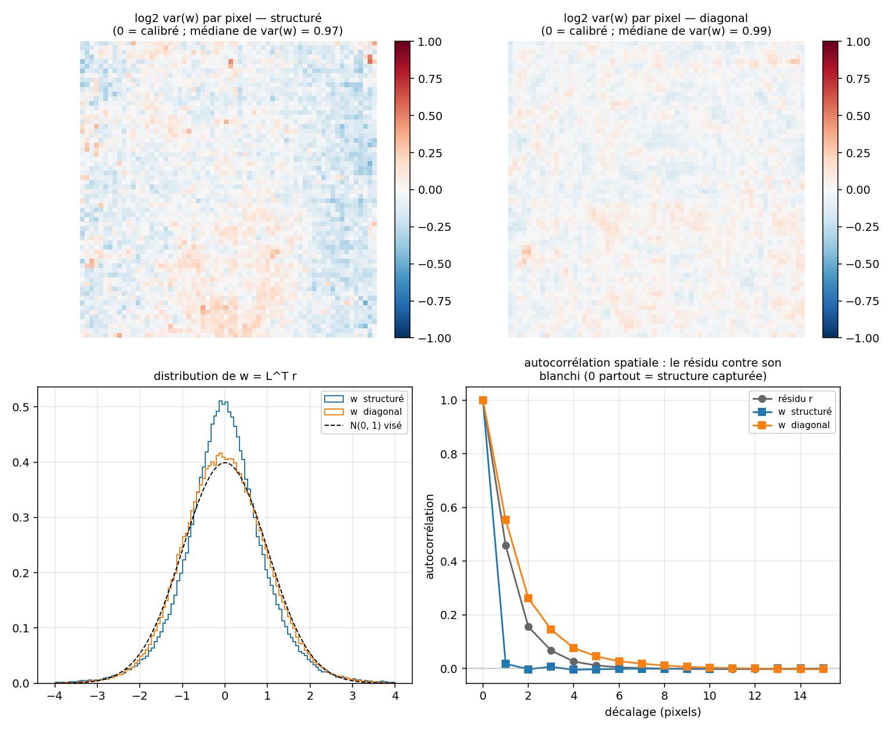
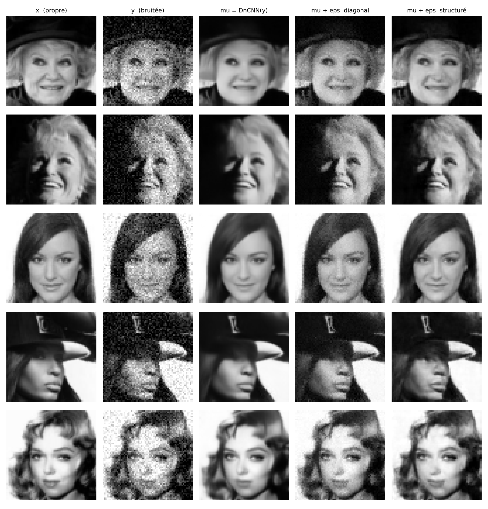

# Structured Uncertainty for Image Denoising — CelebA

An application of **Structured Uncertainty Prediction Networks** (Dorta et al.,
CVPR 2018, [arXiv:1802.07079](https://arxiv.org/abs/1802.07079)) to **image
denoising**, using a DnCNN as the mean model instead of a VAE.

A DnCNN removes noise from an image — but it also removes **high-frequency
detail**: hair, skin texture, fine edges. A second network is trained to
predict the **structured covariance of the residual** `r = x - mu`, where
`mu = DnCNN(y)` is the denoised image and `x` the clean one. That covariance
describes what the denoiser threw away, which makes it possible to sample it
back, or to filter the discarded signal and keep only the part that looks like
plausible face detail.

Third of three projects sharing the same architecture and conventions:

| Project | Data | Repository |
|---|---|---|
| splines | 1D | [structured_uncertainty_spline](https://github.com/coursdeuxthomas/structured_uncertainty_spline) |
| ellipses | 2D synthetic | [structured_uncertainty_ellipse](https://github.com/coursdeuxthomas/structured_uncertainty_ellipse) |
| **celebA** | **2D real, denoising** | **this repository** |

---

## Results

DnCNN trained for 50 epochs (best at epoch 45, validation PSNR 29.9 dB);
covariance network 50 epochs (best at 47); diagonal baseline 50 epochs (best at
43). Everything below is measured on 2,000 held-out test images.

### What the structure buys

| model | test NLL (nat/pixel) | equivalent σ | autocorr. of `w = Lᵀr` at 1 px |
|---|---|---|---|
| raw residual, isotropic Gaussian | −1.3284 | 0.0641 | 0.572 |
| diagonal baseline | −1.5039 | 0.0538 | 0.653 |
| **structured covariance** | **−2.2468** | **0.0256** | **0.024** |

**Structure is worth +0.743 nat/pixel** — a factor 2.10 on the equivalent
standard deviation, or 3,043 nats per image.

The breakdown matters more than the total. The diagonal model gains only
0.176 nat/pixel over the isotropic floor, so **81 % of what covariance
modelling buys comes from the 24 off-diagonal channels**, not from
per-pixel variance. Knowing *which pixels* are uncertain is worth little;
knowing *how they co-vary* is worth almost everything.

### Whitening: the most direct measurement

If the predicted covariance is right, `w = Lᵀ r` must follow `N(0, I)` — unit
variance and no spatial correlation. The structured model drives the residual's
1-pixel autocorrelation from 0.572 down to **0.024**, a factor of 24.

The diagonal model pushes it *up*, to 0.653. This is not an anomaly, and it is
worth understanding: normalising pixel by pixel removes the heteroscedasticity
that was diluting the measurement, so the underlying local correlation shows up
more purely than before. A diagonal model can rescale an amplitude; it cannot
decorrelate. That is a structural impossibility, not a matter of training
budget — which is what makes this the most robust result in the project.

Calibration of the structured model: `var(w) = 0.974` and mean 0.002 on images
never seen during training, with nothing in the loss forcing either value.



*Top: per-pixel `log₂ var(w)`, flat around 0 means calibrated. Bottom left: the
distribution of `w` against the target `N(0,1)`. Bottom right: spatial
autocorrelation — the structured whitened residual collapses at lag 1, the
diagonal one decays slowly over 8 pixels, above the raw residual.*

### Sampling the lost detail

`mu + eps` with `eps ~ N(0, Sigma)`, drawn by sparse back-substitution. The
same noise vector `u` feeds both models, so only the covariance changes from
one column to the next.



*Columns: clean `x`, noisy `y`, `mu = DnCNN(y)`, then `mu + eps` under the
diagonal and the structured model.*

The diagonal model sprinkles a uniform grain over the whole face, including
the smooth regions where there is nothing to add — the image gets dirty, not
sharp. The structured model produces oriented, coherent texture: strands of
hair, the weave of a hat, eyebrows. This reproduces Figure 1 of the paper on
denoising residuals.

### Denoising (§5.3 of the paper)

| method | MSE in [0,1] | PSNR | images improved | `tau*` |
|---|---|---|---|---|
| DnCNN alone | 1.027e-3 | 29.88 dB | — | — |
| `mu + f(s)`, diagonal | 1.027e-3 | 29.89 dB | 54 % | 17.8 σ² |
| `mu + f(s)`, structured | 1.025e-3 | 29.89 dB | 64 % | 10.0 σ² |

**The gain is all but zero, and that is the expected result.** The DnCNN is
trained under MSE, so `mu` approaches `E[x|y]` and therefore `E[r|y] = 0`.
Since `s = y - mu` is a deterministic function of `y`, no additive correction
`g(y)` can reduce the MSE at the optimum. The +0.23 % measures how far the
DnCNN sits from its own optimum, not the quality of Sigma.

What does survive is the **ordering**: the structured filter needs half as much
damping and improves 10 points more images than the diagonal one. Even in the
task where the total gain is nil by construction, the structured covariance is
the more useful of the two.

The paper compares against a denoising autoencoder (Table 4: DAE 5.13e-3
against 2.99e-3). Our baseline is a real denoiser, a considerably tougher
opponent, so the two sets of numbers are not comparable.

---

## How it works

### The model

The residual is modelled as a full multivariate Gaussian, `r ~ N(0, Sigma)`.
Rather than the covariance, the network predicts the **precision**
`Lambda = Sigma⁻¹` through its Cholesky factor `Lambda = L Lᵀ`, with `L` lower
triangular. Positivity is free: the network outputs `log(l_ii)` and exponen-
tiates. The negative log-likelihood is then evaluated without ever inverting
anything:

```
nll = 0.5 * [ -2 * Σᵢ log(l_ii) + ‖ Lᵀ r ‖² + n·log(2π) ]
```

**Sparsity.** With `n = 64×64 = 4096` pixels, a dense Cholesky factor would
need 8,390,656 values per image. The paper's pattern is imposed instead:
`l_ij ≠ 0` only if `i ≥ j` and pixels `i, j` are neighbours inside an `f × f`
patch, with `f = 7`. That leaves 24 off-diagonal values plus the diagonal —
**25 values per pixel, 102,400 per image**, a factor of 82.

> A single `n × n` float32 matrix weighs 67 MB, and a batch of 64 would weigh
> 4.3 GB. **No dense matrix is ever formed**, at training or at evaluation.
> Every operation is expressed as a scatter/gather over the 25 channels.

Under this pattern the model is a Gaussian Random Field on the residual: a zero
in the precision matrix means two pixels are conditionally independent given
all the others.

### Two-stage training

The DnCNN is trained first, then **frozen** — this is Eq. 4 of the paper,
*"keeping the generative model parameters θ fixed"*. Only the covariance
network is optimised afterwards:

```python
y = x + sigma * torch.randn_like(x)
with torch.no_grad():                    # halves the memory, and θ is fixed
    mu = dncnn(y)
r = x - mu
log_diag, offdiag = cov_net(mu)
loss = structured_gaussian_nll(log_diag, offdiag, r, neighbor_idx, mask)
```

Hyper-parameters from the paper: Adam, lr `1e-3`, 50 epochs, batch 64.

### The two networks

| | architecture | parameters |
|---|---|---|
| `dncnn.py` | 17 layers Conv-BN-ReLU, 64 channels, residual learning | 556 k |
| `cov_model.py` | 3-level U-Net (32/64/128), 1×1 head with 25 channels | 519 k |

The head is **initialised to zero**, so the first prediction is exactly the
isotropic Gaussian fitted to the residual. A consequence worth knowing before
debugging it: the trunk receives no gradient at all on the first iteration,
because `Wᵀg = 0`. This is expected, not a bug.

### Two deliberate departures from the paper

1. **The mean model is a DnCNN, not a VAE.** A DnCNN has no latent code, so the
   covariance network cannot be conditioned on `z`. It is conditioned on `mu`
   instead — which is one of the two regimes the authors use themselves, in the
   synthetic experiments of §5.1: *"bypassing the use of a generative model,
   and directly predicting Σ from µ"*. The residual also changes meaning, from
   a VAE reconstruction error to a genuine denoising error.

2. **Denoising uses a Wiener filter, not a spectral projection.** The paper
   projects onto the 1000 leading eigenvectors of Sigma, which costs `O(n³)`
   per image and requires forming Sigma. The Wiener filter has the same intent
   and collapses to

   ```
   f(s) = Sigma (Sigma + tau·I)⁻¹ s = (I + tau·Lambda)⁻¹ s
   ```

   with no Sigma left at all — only the precision the network already predicts.
   The system is symmetric positive definite, so it is solved by conjugate
   gradient, each matrix-vector product `Lambda v = L(Lᵀv)` costing `O(n·m)`.
   And `tau` is not an arbitrary knob: under `s = r + noise`, the posterior
   mean `E[r|s]` is exactly this filter with `tau = σ²`, so the empirically
   optimal `tau` doubles as a calibration diagnostic.

---

## Data

- CelebA "aligned & cropped", centre crop of 148 px, resized to **64 × 64**,
  converted to grayscale, normalised to `[-1, 1]`.
- Official split: **182,637 train / 19,962 test** (`train + valid` for
  training, `test` for testing).
- Noise: `y = x + sigma · N(0, I)` with `sigma = 25/255`, drawn **on the fly**
  at every access, so the residual can never be memorised.
- Images are cached as `uint8` (830 MB, fits in RAM); a float32 cache would be
  3.3 GB.

> `sigma = 25/255` is the usual figure in `[0,1]`. In `[-1,1]` it becomes
> **0.196** — a factor of 2, and a factor of 4 on any MSE. All MSE figures in
> this README are converted back to `[0,1]` to stay comparable with the
> literature.

The dataset is not versioned. See `docs/PROCEDURE.md`, or:

```bash
python download.py     # requires Kaggle credentials
```

`data.py` splits by index, so a truncated download produces a wrong split with
no error message. The count must be exactly 202,599.

---

## Repository layout

Code, at the root:

| File | Role |
|---|---|
| `data.py` | preprocessing, cache, `CelebADataset` (returns `x` and `y`) |
| `dncnn.py` | the denoiser |
| `train_dncnn.py` | stage 1 — train the denoiser |
| `loss.py` | structured Gaussian NLL, sparse Cholesky, `f = 7` |
| `cov_model.py` | covariance network: `mu` → `log_diag`, `offdiag` |
| `train_cov.py` | stage 2 — train the covariance, DnCNN frozen |
| `eval_cov.py` | stage 3 — NLL, diagonal baseline, calibration, samples |
| `denoise.py` | the §5.3 application: Wiener filter on the residual |
| `main.py` | progress dashboard, and the evaluation pipeline |

SLURM jobs:

| File | Role |
|---|---|
| `build_data.bash` | build the cache |
| `train_dncnn.bash` | stage 1 |
| `train_cov.bash` | stage 2 — **run twice**: plain, then `--diagonale` |
| `surapprentissage.bash` | the overfitting test |
| `evaluation.bash` | stage 3: `eval_cov.py` then `denoise.py` |

Documentation, in `docs/` (in French):

| File | Role |
|---|---|
| `docs/tuteur.txt` | the reference document: model, figures, decisions, traps |
| `docs/PROCEDURE.md` | getting the images and building the cache |
| `docs/roadmap_celeba_dncnn.txt` | what comes from the paper, what is a variant |
| `docs/explication_data.txt` | line-by-line commentary on `data.py` |
| `docs/explication_dncnn.txt` | line-by-line commentary on stage 1 |

`results/` keeps only the final figures and the JSON result files under version
control. Checkpoints, the `.npy` cache and SLURM logs stay out of the
repository.

---

## Reproducing

```bash
python -m venv venv && source venv/bin/activate
pip install numpy torch matplotlib pillow kaggle

export CELEBA_DIR=$HOME/data/celeba/img_align_celeba
export CELEBA_CACHE=$HOME/data/celeba/celeba_64_gray.npy

python data.py --build          # once, 10-20 min
sbatch train_dncnn.bash         # stage 1
python verifier_residu.py       # the critical check, see below
sbatch train_cov.bash           # stage 2, structured
sbatch train_cov.bash --diagonale   # stage 2, baseline — a SECOND full run
sbatch evaluation.bash          # stage 3
python main.py                  # dashboard: what is done, what comes next
```

`sbatch train_cov.bash --diagonale` is a **second complete training run**, not
an evaluation flag. Without it the NLL of the structured model is a number
without a scale, and nothing is demonstrated.

Both training stages take roughly 8 minutes per epoch on a Tesla T4, so 50
epochs is about 6h30 — more than the 1h55 partition limit. `--resume` is built
into the job scripts; re-submitting the same script continues where it stopped.
Expect three or four jobs per run.

## Verification

Every non-trivial numerical routine has a self-test that runs at 16×16, where
the dense matrix fits in memory and can serve as ground truth.

| Command | What it proves |
|---|---|
| `python loss.py` | the sparse NLL against the dense matrix (error 4.8e-07) |
| `python cov_model.py` | output shapes and the zero initialisation |
| `python eval_cov.py --verif` | `apply_L`, its transposition, and sampling |
| `python denoise.py --verif` | the conjugate gradient against a dense solve |
| `sbatch surapprentissage.bash` | `loss.py` and `cov_model.py` working together |
| `python verifier_residu.py` | **the critical check** — see below |
| `python verifier_alignement.py` | the faces really are aligned |

**The critical check.** The whole project rests on one assumption: that the
DnCNN residual is spatially structured rather than white noise. If it were
white, there would be nothing to model. Measured on the final denoiser:
autocorrelation 0.547 horizontally and 0.598 vertically at 1 pixel, against
−0.001 for a white-noise control, with a range of 3 pixels
(`results/residu.png`).

Better still, the assumption *strengthens* as the denoiser improves. Between a
3-epoch DnCNN and the final 50-epoch one, the residual standard deviation drops
from 0.0698 to 0.0640 while its autocorrelation *rises* from 0.537 to 0.547.
The DnCNN removes mostly the white component of the residual; what remains is
proportionally more correlated.

**One subtlety that does not crash.** `build_neighbor_indices` answers "in row
`i` of `L`, which `j`?", while back-substitution needs "in column `i` of `L`,
which `j`?". Getting the sign of the offset wrong does not raise anything — it
silently samples from a different distribution. Hence
`python eval_cov.py --verif`.

## Known limitations

- **`w` is not Gaussian.** Its variance is 0.974, but its distribution is
  clearly leptokurtic: more peaked than `N(0,1)` and with heavier tails. The
  model captures the second-order structure of the residual well; the marginal
  law of image residuals is simply not Gaussian.
- **The conjugate gradient does not reach tolerance** on the hardest images in
  the denoising run reported above: 60 iterations are consumed without
  converging to 1e-6 (`residu_cg` in `results/denoise.json`). Re-running
  `denoise.py --cg 400` is the fix. Only the denoising figures depend on it —
  the NLL, the calibration and the samples use no CG at all.
- **The denoising figure shows nothing to the eye.** With `tau* = 10 σ²` the
  correction is small, and `results/denoise.png` looks the same in all three
  columns. Unlike the paper, whose baseline is a VAE that never saw noise, ours
  is a real denoiser and there is little visible ground to make up.

## Reference

Dorta, G., Vicente, S., Agapito, L., Campbell, N. D. F., Simpson, I.
*Structured Uncertainty Prediction Networks*. CVPR 2018.
